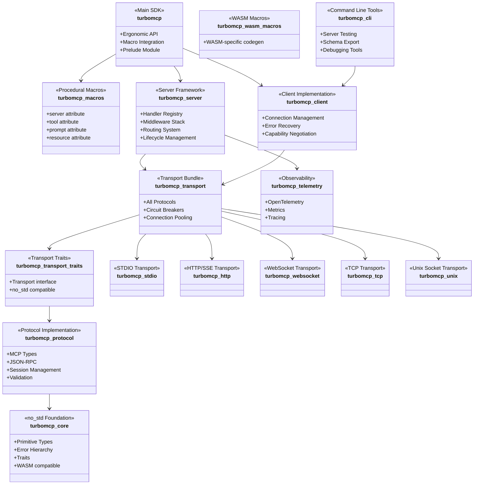

# TurboMCP Crates

This directory contains the individual crates that make up the TurboMCP framework. Each crate is designed with a specific responsibility and can be used independently or as part of the complete framework.

## Table of Contents

- [v3.x Architecture & Performance Highlights](#v3x-architecture--performance-highlights)
- [Architecture Overview](#architecture-overview)
- [Crates](#crates)
  - [turbomcp (Main SDK)](#turbomcp---main-sdk)
  - [turbomcp-core (no_std Foundation)](#turbomcp-core---nostd-foundation)
  - [turbomcp-protocol (Protocol Implementation)](#turbomcp-protocol---protocol-implementation)
  - [turbomcp-transport-traits (Transport Traits)](#turbomcp-transport-traits---transport-traits)
  - [turbomcp-transport (Transport Layer)](#turbomcp-transport---transport-layer)
  - [Individual Transport Crates](#individual-transport-crates)
  - [turbomcp-server (Server Framework)](#turbomcp-server---server-framework)
  - [turbomcp-client (Client Implementation)](#turbomcp-client---client-implementation)
  - [turbomcp-macros (Procedural Macros)](#turbomcp-macros---procedural-macros)
  - [turbomcp-cli (Command Line Tools)](#turbomcp-cli---command-line-tools)
  - [turbomcp-auth (Authentication)](#turbomcp-auth---authentication)
  - [turbomcp-dpop (DPoP)](#turbomcp-dpop---dpop)
  - [turbomcp-telemetry (Observability)](#turbomcp-telemetry---observability)
  - [turbomcp-grpc, turbomcp-wasm, and others](#turbomcp-grpc-turbomcp-wasm-and-others)
- [Usage Patterns](#usage-patterns)
- [Documentation](#documentation)
- [Contributing](#contributing)

## v3.x Architecture & Performance Highlights

**Major improvements in 3.0.x:**
- **Re-extracted turbomcp-core** - No_std foundation layer extracted from protocol for embedded and WASM targets
- **Modular Transport Crates** - Individual transport crates (stdio, http, websocket, tcp, unix) replace monolithic transport
- **Lean Transport Traits** - `turbomcp-transport-traits` provides the shared interface without pulling in all transports
- **Edge-Native WASM Support** - `turbomcp-wasm` and `turbomcp-wasm-macros` for browser and edge runtimes
- **OpenTelemetry Integration** - `turbomcp-telemetry` for production observability
- **Zero-Copy Optimizations** - Enhanced message processing with minimal allocations
- **Zero Known Vulnerabilities** - Comprehensive security audit maintained

## Architecture Overview



## Crates

### [`turbomcp`](./turbomcp/) - Main SDK
[](https://docs.rs/turbomcp)

The main SDK crate providing ergonomic APIs and integration. This is what most users will interact with directly.

**Key Features:**
- Procedural macro integration
- Prelude module with common imports
- High-level server and client APIs
- Performance optimizations and SIMD support

### [`turbomcp-core`](./turbomcp-core/) - no_std Foundation

Low-level foundation layer designed for embedded and WASM targets. Contains primitive types, the core error hierarchy, and shared traits that all other crates build on.

**Key Features:**
- `no_std` compatible with optional `alloc`
- Primitive MCP types and identifiers
- Core error hierarchy
- Shared traits for protocol and transport abstraction
- WASM and embedded target support

### [`turbomcp-protocol`](./turbomcp-protocol/) - Protocol Implementation
[](https://docs.rs/turbomcp-protocol)

Complete implementation of the Model Context Protocol specification with JSON-RPC support.

**Key Features:**
- MCP 2025-11-25 specification compliance
- JSON-RPC 2.0 with batching support
- SIMD-accelerated JSON processing and zero-copy message handling
- Comprehensive error handling with rich context
- Session management with LRU eviction
- Request/response context tracking
- Type-safe capability negotiation
- Protocol version negotiation
- Comprehensive validation

### [`turbomcp-transport-traits`](./turbomcp-transport-traits/) - Transport Traits

Lean crate exposing the `Transport` trait and associated types. Depend on this instead of the full `turbomcp-transport` bundle when building custom transports or keeping dependency surface minimal.

**Key Features:**
- `Transport` trait definition
- Common transport error types
- `no_std`-friendly interface
- No dependency on any concrete transport implementation

### [`turbomcp-transport`](./turbomcp-transport/) - Transport Layer
[](https://docs.rs/turbomcp-transport)

Convenience bundle that re-exports all individual transport crates behind feature flags.

**Key Features:**
- Feature-gated transports: `stdio`, `http`, `websocket`, `tcp`, `unix`
- Circuit breakers and retry logic with exponential backoff
- Connection pooling with configurable limits
- Health monitoring and graceful degradation
- Message compression support

### Individual Transport Crates

Each transport protocol is available as its own standalone crate:

| Crate | Transport | Feature flag |
|---|---|---|
| [`turbomcp-stdio`](./turbomcp-stdio/) | Standard I/O | `stdio` |
| [`turbomcp-http`](./turbomcp-http/) | HTTP/SSE + Streamable HTTP | `http` |
| [`turbomcp-websocket`](./turbomcp-websocket/) | WebSocket | `websocket` |
| [`turbomcp-tcp`](./turbomcp-tcp/) | Raw TCP | `tcp` |
| [`turbomcp-unix`](./turbomcp-unix/) | Unix domain sockets | `unix` |

Use these directly when you need only one transport and want to minimize compile times and binary size.

### [`turbomcp-server`](./turbomcp-server/) - Server Framework
[](https://docs.rs/turbomcp-server)

MCP server implementation with middleware support, routing, and lifecycle management.

**Key Features:**
- Handler registry with type-safe registration
- OAuth 2.1 authentication with Google, GitHub, Microsoft providers
- Middleware stack for PKCE security, rate limiting, security headers
- Request routing and lifecycle management
- Health checks and graceful shutdown
- Performance metrics and monitoring

### [`turbomcp-client`](./turbomcp-client/) - Client Implementation
[](https://docs.rs/turbomcp-client)

MCP client implementation with connection management and error recovery.

**Key Features:**
- LLM backend support (Anthropic, OpenAI)
- Interactive elicitation with real-time user input
- Connection management with automatic reconnection
- Error handling and recovery mechanisms
- Support for all MCP capabilities
- Transport-agnostic design
- Type-safe protocol communication

### [`turbomcp-macros`](./turbomcp-macros/) - Procedural Macros
[](https://docs.rs/turbomcp-macros)

Procedural macros for ergonomic MCP server development.

**Key Features:**
- `#[server]` - Convert structs into MCP servers
- `#[tool]` - Mark methods as tool handlers with automatic schema generation
- `#[prompt]` - Mark methods as prompt handlers
- `#[resource]` - Mark methods as resource handlers with URI templates
- Automatic JSON schema generation at compile time

### [`turbomcp-cli`](./turbomcp-cli/) - Command Line Tools
[](https://docs.rs/turbomcp-cli)

Command-line interface for interacting with MCP servers, testing, and debugging.

**Key Features:**
- Connect to servers via multiple transports
- List available tools and call them with arguments
- Export tool schemas for documentation
- Server testing and validation
- OAuth 2.1 client authentication support

### [`turbomcp-auth`](./turbomcp-auth/) - Authentication

OAuth 2.1 with PKCE support. Optional dependency; enable with the `auth` feature flag.

**Key Features:**
- OAuth 2.1 + PKCE flow
- Multi-provider support (Google, GitHub, Microsoft, and custom)
- Token refresh and revocation

### [`turbomcp-dpop`](./turbomcp-dpop/) - DPoP

RFC 9449 Demonstration of Proof-of-Possession. Optional dependency; requires the `auth` feature and one of `dpop`, `dpop-redis`, `dpop-hsm-pkcs11`, or `dpop-hsm-yubico`.

### [`turbomcp-telemetry`](./turbomcp-telemetry/) - Observability

OpenTelemetry integration for production observability.

**Key Features:**
- Distributed tracing via OpenTelemetry
- Metrics export (Prometheus-compatible)
- Structured log correlation
- Optional dependency; enable with the `telemetry` feature flag

### [`turbomcp-grpc`](./turbomcp-grpc/), [`turbomcp-wasm`](./turbomcp-wasm/), and others

Additional crates rounding out the v3 ecosystem:

- **turbomcp-grpc** - gRPC transport adapter
- **turbomcp-wasm** - Browser and edge runtime support (WASM)
- **turbomcp-wasm-macros** - WASM-specific code generation macros
- **turbomcp-wire** - Low-level wire format utilities
- **turbomcp-openapi** - OpenAPI schema generation from MCP tool definitions
- **turbomcp-transport-streamable** - Streamable HTTP transport (MCP 2025-11-25)
- **turbomcp-proxy** - Universal MCP adapter and code generation

## Usage Patterns

### Complete Framework (Recommended)
```toml
[dependencies]
turbomcp = "3.1.3"
```

### Specific Layers Only
```toml
[dependencies]
# For building custom servers
turbomcp-server = "3.1.3"
turbomcp-transport = "3.1.3"

# For building custom clients
turbomcp-client = "3.1.3"
turbomcp-protocol = "3.1.3"

# For low-level protocol work
turbomcp-protocol = "3.1.3"

# For a single transport (minimal deps)
turbomcp-stdio = "3.1.3"
turbomcp-transport-traits = "3.1.3"

# For no_std / WASM targets
turbomcp-core = "3.1.3"
```

### Development Tools
```bash
# Install CLI tools
cargo install --path turbomcp-cli

# Use for testing HTTP servers
turbomcp-cli tools list --url http://localhost:8080/mcp

# Use for testing STDIO servers
turbomcp-cli tools list --command "./my-server"
```

## Documentation

Each crate has its own README.md with detailed usage examples and API documentation. The main documentation is available at:

- [API Documentation](https://docs.rs/turbomcp) - Complete API reference
- [Architecture Guide](../ARCHITECTURE.md) - System design and component interaction
- [Migration Guide](../MIGRATION.md) - v1/v2/v3 migration
- [MCP Specification](https://modelcontextprotocol.io) - Official protocol documentation

## Contributing

When contributing to specific crates:

1. **Foundation (no_std primitives)** → [`turbomcp-core`](./turbomcp-core/)
2. **Protocol updates** → [`turbomcp-protocol`](./turbomcp-protocol/)
3. **Transport interface** → [`turbomcp-transport-traits`](./turbomcp-transport-traits/)
4. **Transport implementations** → individual transport crates (`turbomcp-stdio`, `turbomcp-http`, etc.)
5. **Transport bundle** → [`turbomcp-transport`](./turbomcp-transport/)
6. **Server features** → [`turbomcp-server`](./turbomcp-server/)
7. **Client features** → [`turbomcp-client`](./turbomcp-client/)
8. **Macro improvements** → [`turbomcp-macros`](./turbomcp-macros/)
9. **CLI features** → [`turbomcp-cli`](./turbomcp-cli/)
10. **Integration work** → [`turbomcp`](./turbomcp/)

See the main [CONTRIBUTING.md](../CONTRIBUTING.md) for general contribution guidelines.
