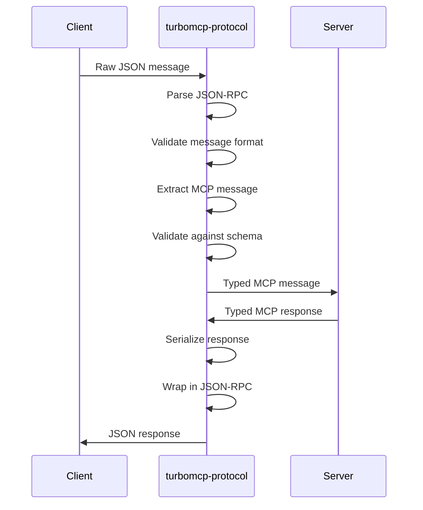

# TurboMCP Protocol

[](https://crates.io/crates/turbomcp-protocol)
[](https://docs.rs/turbomcp-protocol)
[](https://opensource.org/licenses/MIT)

Model Context Protocol (MCP) implementation for MCP `2025-11-25`, with JSON-RPC 2.0 and runtime schema validation.

## Table of Contents

- [Overview](#overview)
  - [MCP Version Support](#mcp-version-support)
- [Key Features](#key-features)
- [Version Selection Guide](#version-selection-guide)
  - [Choosing the Right MCP Version](#choosing-the-right-mcp-version)
  - [Feature-by-Feature Selection](#feature-by-feature-selection)
  - [Runtime Version Negotiation](#runtime-version-negotiation)
  - [Migration Path](#migration-path)
- [Architecture](#architecture)
- [MCP Message Types](#mcp-message-types)
- [Usage](#usage)
- [Message Flow](#message-flow)
- [Feature Flags](#feature-flags)
  - [MCP 2025-11-25 Draft Features](#mcp-2025-11-25-draft-specification-features)
- [Supported MCP Methods](#supported-mcp-methods)
- [Integration](#integration)

## Overview

`turbomcp-protocol` provides a specification-compliant implementation of the Model Context Protocol (MCP). This crate handles protocol-level concerns including message formatting, capability negotiation, and runtime validation.

### MCP Version Support

TurboMCP v3.0 targets MCP `2025-11-25`.
Core protocol capabilities are enabled by default, and runtime negotiation is exact-match only.

| Spec Version | Status | Notes |
|--------------|--------|-------|
| **MCP 2025-11-25** | ✅ Full Support | Canonical v3 protocol surface |

**Quick Start:**
```toml
[dependencies]
turbomcp-protocol = "3.1.3"
```

Only the experimental Tasks API (SEP-1686) requires a feature flag:
```toml
[dependencies]
turbomcp-protocol = { version = "3.1.3", features = ["experimental-tasks"] }
```

## Key Features

### MCP Specification Support
- MCP specification implementation with current message types
- Tools, resources, prompts, and capabilities support
- Capability negotiation with feature detection and handshake
- Exact-version negotiation support

### JSON-RPC 2.0 Implementation
- Compliant message format with request, response, and notification handling
- ID correlation for automatic request/response matching
- Standard JSON-RPC error codes and extensions
- Support for batch request/response operations

### Runtime Schema Validation
- JSON Schema validation using `jsonschema` crate
- Rust type definitions for MCP message types
- Tool and resource parameter validation
- Schema generation from Rust types

### Capability Management
- Type-State Capability Builders - Compile-time validated capability configuration
- Server capabilities for tools, resources, prompts declarations
- Client capabilities including sampling, roots, progress reporting
- Feature negotiation with capability matching
- Support for custom capability extensions

### MCP Enhanced Features
- Bidirectional communication for server-initiated requests to clients
- Elicitation support for server-requested structured input from users
- Completion context with references and metadata
- Resource templates for dynamic resource generation with parameters
- Ping/keepalive for connection health monitoring

## Architecture

```
┌─────────────────────────────────────────────┐
│            TurboMCP Protocol                │
├─────────────────────────────────────────────┤
│ MCP Message Types                          │
│ ├── InitializeRequest/InitializeResult     │
│ ├── Tool/Resource/Prompt messages          │
│ ├── Capability negotiation               │
│ └── Notification handling                 │
├─────────────────────────────────────────────┤
│ JSON-RPC 2.0 Layer                        │
│ ├── Request/Response correlation          │
│ ├── ID generation and tracking           │
│ ├── Error code standardization           │
│ └── Batch message processing             │
├─────────────────────────────────────────────┤
│ Schema Validation                          │
│ ├── Runtime JSON schema validation       │
│ ├── Parameter type checking              │
│ ├── Response format validation           │
│ └── Custom schema extension support      │
└─────────────────────────────────────────────┘
```

## MCP Message Types

### Core Message Types

```rust
use turbomcp_protocol::{
    // Re-exported for convenience (most common types)
    InitializeRequest, InitializeResult,
    CallToolRequest, CallToolResult,
    ReadResourceRequest, ReadResourceResult,
    GetPromptRequest, GetPromptResult,
    // List types available via types module
};

use turbomcp_protocol::types::{
    ListToolsRequest, ListToolsResult,
    ListResourcesRequest, ListResourcesResult,
    ListPromptsRequest, ListPromptsResult,
    Tool, Resource, Prompt,
};
```

### MCP Enhanced Types

```rust
use turbomcp_protocol::{
    // Bidirectional communication support (trait)
    ServerToClientRequests,
};

use turbomcp_protocol::types::{
    // Elicitation - Server requests user input
    ElicitRequestParams, ElicitRequestFormParams, ElicitRequestURLParams, ElicitResult,

    // Completion - Intelligent autocompletion
    CompleteRequestParams, CompletionResponse,

    // Resource Templates - Dynamic resources
    ListResourceTemplatesRequest, ListResourceTemplatesResult,

    // Ping - Bidirectional health monitoring
    PingRequest, PingResult,
};
```

### JSON-RPC Infrastructure

```rust
use turbomcp_protocol::{
    JsonRpcRequest, JsonRpcResponse, JsonRpcNotification,
    JsonRpcError, JsonRpcErrorCode, RequestId,
};
```

## Usage

### Basic Protocol Handling

```rust
use turbomcp_protocol::{
    JsonRpcRequest, JsonRpcResponse, InitializeRequest,
    ListToolsRequest, Error as McpError
};

// Parse incoming JSON-RPC request
let json_data = r#"{
    "jsonrpc": "2.0",
    "id": 1,
    "method": "initialize",
    "params": {
        "protocolVersion": "2025-11-25",
        "capabilities": {},
        "clientInfo": {"name": "test-client", "version": "2.0.0"}
    }
}"#;

let request: JsonRpcRequest = serde_json::from_str(json_data)?;

// Handle specific message types
match request.method.as_str() {
    "initialize" => {
        let params = request.params.unwrap_or_default();
        let init_req: InitializeRequest = serde_json::from_value(params)?;
        // Process initialization
    },
    "tools/list" => {
        let params = request.params.unwrap_or_default();
        let tools_req: ListToolsRequest = serde_json::from_value(params)?;
        // Process tools list request
    },
    _ => {
        // Handle unknown method
    }
}
```

### Message Validation

```rust
use turbomcp_protocol::{
    JsonRpcRequest,
    validation::{ProtocolValidator, ValidationResult}
};

// Create a validator with default rules
let validator = ProtocolValidator::default();

// Parse and validate a JSON-RPC request
let json_data = r#"{
    "jsonrpc": "2.0",
    "id": 1,
    "method": "tools/call",
    "params": {"name": "add", "arguments": {"a": 5, "b": 3}}
}"#;

let request: JsonRpcRequest = serde_json::from_str(json_data)?;
let result = validator.validate_request(&request);

match result {
    ValidationResult::Valid => {
        println!("Request is valid");
    },
    ValidationResult::ValidWithWarnings(warnings) => {
        println!("Request valid with {} warnings", warnings.len());
    },
    ValidationResult::Invalid(errors) => {
        eprintln!("Request invalid: {} errors", errors.len());
    }
}
```

### Type-State Capability Builders

```rust
use turbomcp_protocol::capabilities::builders::{
    ServerCapabilitiesBuilder, ClientCapabilitiesBuilder
};

// Compile-time validated server capabilities
let server_caps = ServerCapabilitiesBuilder::new()
    .enable_tools()                    // Enable tools capability
    .enable_resources()                // Enable resources capability
    .enable_prompts()                  // Enable prompts capability
    .enable_tool_list_changed()        // ✅ Only available when tools enabled
    .enable_resources_subscribe()      // ✅ Only available when resources enabled
    .enable_resources_list_changed()   // ✅ Only available when resources enabled
    .build();

// Opt-out client capabilities (all enabled by default)
let client_caps = ClientCapabilitiesBuilder::new()
    .enable_roots_list_changed()       // Configure sub-capabilities
    .build();                          // All capabilities enabled!

// Opt-in pattern for restrictive clients
let minimal_client = ClientCapabilitiesBuilder::minimal()
    .enable_sampling()                 // Only enable what you need
    .enable_roots()
    .build();
```

### Traditional Capability Negotiation

```rust
use turbomcp_protocol::{
    ServerCapabilities, ClientCapabilities,
    types::{ToolsCapabilities, ResourcesCapabilities, PromptsCapabilities, RootsCapabilities}
};

// Traditional approach (still supported)
let server_caps = ServerCapabilities {
    tools: Some(ToolsCapabilities {
        list_changed: Some(true),
    }),
    resources: Some(ResourcesCapabilities {
        subscribe: Some(true),
        list_changed: Some(true),
    }),
    prompts: Some(PromptsCapabilities {
        list_changed: Some(false),
    }),
    experimental: None,
    ..Default::default()
};

// Define client capabilities
let client_caps = ClientCapabilities {
    sampling: None,
    roots: Some(RootsCapabilities {
        list_changed: Some(true),
    }),
    experimental: None,
    ..Default::default()
};
```

### Error Handling

The protocol crate re-exports `McpError` (also aliased as `Error`) from
`turbomcp-core` as the canonical MCP error type, with rich context and
observability support.

#### Creating Errors

Error constructors return `McpError` directly (not `Box<_>`):

```rust
use turbomcp_protocol::{McpError, ErrorKind};

// MCP specification errors (map to standard error codes)
let err = McpError::tool_not_found("calculator");              // -32001
let err = McpError::tool_execution_failed("calc", "div by 0"); // -32002
let err = McpError::prompt_not_found("code_review");           // -32003
let err = McpError::resource_not_found("file:///missing");     // -32004
let err = McpError::resource_access_denied("file:///etc/passwd", "forbidden"); // -32005
let err = McpError::invalid_params("Email must be valid");     // -32602
let err = McpError::user_rejected("User declined sampling");   // -1

// Add context with the builder pattern
let err = McpError::internal("Database error")
    .with_operation("user_create")
    .with_component("postgres_repository")
    .with_request_id("req-123");
```

#### Working with JSON-RPC Errors

```rust
use turbomcp_protocol::{JsonRpcError, JsonRpcErrorCode, McpError, ErrorKind};

// Create JSON-RPC errors directly. `JsonRpcError::code` is an i32;
// use `JsonRpcErrorCode::code()` to get the numeric value.
fn handle_tool_error(error: &str) -> JsonRpcError {
    JsonRpcError {
        code: JsonRpcErrorCode::InvalidParams.code(),
        message: format!("Tool validation failed: {}", error),
        data: None,
    }
}

// Convert an McpError to its JSON-RPC / HTTP numeric codes
let err = McpError::tool_not_found("calculator");
let code = err.jsonrpc_error_code();  // -32001
let http = err.http_status();         // 404

// Inspect the ErrorKind directly
assert_eq!(err.kind, ErrorKind::ToolNotFound);
```

#### Error Properties

```rust
use turbomcp_protocol::McpError;

let err = McpError::timeout("Request took too long");

// Check error characteristics
if err.is_retryable() {
    // Retry the operation
}

if err.is_temporary() {
    // Wait and retry
}

// Get HTTP status code for REST APIs
let status = err.http_status();          // 408

// Get MCP-compliant JSON-RPC error code
let code = err.jsonrpc_error_code();     // -32012
```

#### Integration with Application Layer

If you're using the main `turbomcp` crate, you typically use `McpError` in your tool handlers. The server layer automatically converts to `Box<Error>`:

```rust
// In your tool handler (turbomcp crate)
use turbomcp::{McpError, McpResult};

#[tool("My tool")]
async fn my_tool(&self) -> McpResult<String> {
    Err(McpError::tool("Something failed".into()))  // Simple error
}

// Server layer converts to:
// ServerError::Protocol(Error::tool_execution_failed("my_tool", "Something failed"))
```

See the [turbomcp crate error handling docs](../turbomcp/README.md#error-handling) for the complete error architecture.

### Custom Message Types

```rust
use turbomcp_protocol::{JsonRpcRequest, JsonRpcResponse, JsonRpcVersion};
use turbomcp_core::RequestId;
use serde::{Serialize, Deserialize};

// Define custom message types
#[derive(Serialize, Deserialize)]
struct CustomRequest {
    custom_field: String,
    optional_data: Option<serde_json::Value>,
}

#[derive(Serialize, Deserialize)]
struct CustomResponse {
    result: String,
    metadata: serde_json::Value,
}

// Create custom JSON-RPC messages.
// Note: `jsonrpc` is a `JsonRpcVersion` newtype, and `params` is `Option<Value>`.
fn create_custom_request(id: RequestId, params: CustomRequest) -> JsonRpcRequest {
    JsonRpcRequest {
        jsonrpc: JsonRpcVersion::default(),
        id,
        method: "custom/method".to_string(),
        params: Some(serde_json::to_value(params).unwrap()),
    }
}
```

## Message Flow



## Version Selection Guide

### Protocol Version

TurboMCP v3 targets MCP `2025-11-25`. The default `VersionManager`
(`VersionManager::default()` / `Version::known_versions()`) advertises
the stable set — `2025-06-18` and `2025-11-25` — and negotiates exact
matches (newest is selected as current).

For full cross-version translation with older peers, the crate also
ships version adapters for `2025-06-18` (and a draft `DRAFT-2026-v1`
type) in `turbomcp_protocol::versioning::adapter` — use
`adapter_for_version` to opt into field-level filtering.

### Core Features (Always Enabled)

All core MCP 2025-11-25 features are now always available - no feature flags needed:

- **URL Elicitation** (SEP-1036) - URL mode for OAuth/sensitive data
- **Sampling Tools** (SEP-1577) - Tool calling in LLM sampling
- **Icons** (SEP-973) - Icon metadata for tools, resources, prompts
- **Enum Improvements** (SEP-1330) - Standards-compliant enum schemas

```toml
[dependencies]
turbomcp-protocol = "3.1.3"  # All core features included
```

### Runtime Version Negotiation

**Client-side:**
```rust
use turbomcp_protocol::{InitializeRequest, ClientCapabilities};

// `protocol_version` is a `ProtocolVersion`; string literals convert via `.into()`.
let init = InitializeRequest {
    protocol_version: "2025-11-25".into(),
    capabilities: ClientCapabilities::default(),
    client_info: /* ... */,
    _meta: None,
};
```

**Server-side:**
```rust
use turbomcp_protocol::{InitializeResult, ServerCapabilities};

// With the default `VersionManager`, the server must respond with the
// exact version it supports (2025-11-25) or fail initialization.
let result = InitializeResult {
    protocol_version: "2025-11-25".into(),
    capabilities: ServerCapabilities::default(),
    server_info: /* ... */,
    instructions: None,
    _meta: None,
};
```

**Key Principle:** Clients request a version; the default server
implementation accepts it only on exact match. Use the adapters in
`versioning::adapter` if you need to translate across versions.

### Migration from v2.x

This section is historical. v3 does not preserve the old multi-version runtime policy.

TurboMCP v3.0 simplifies feature flags - all MCP 2025-11-25 features are now core:

**Before (v2.x):**
```toml
turbomcp-protocol = { version = "2.x", features = ["mcp-url-elicitation", "mcp-icons"] }
```

**After (v3.0):**
```toml
turbomcp-protocol = "3.1.3"  # All features included by default
```

**Example:**
```rust
// No feature guards needed - URLElicitRequestParams is always available
use turbomcp_protocol::types::URLElicitRequestParams;

fn handle_sensitive_input(params: URLElicitRequestParams) {
    // URL mode is always available
}
```

## Feature Flags

### Default Features

| Feature | Description | Default |
|---------|-------------|---------|
| `std` | Standard library support | ✅ |
| `simd` | SIMD-accelerated JSON parsing (simd-json, sonic-rs) | ✅ |

### Performance Features

| Feature | Description | Default |
|---------|-------------|---------|
| `zero-copy` | Zero-copy message handling (`bytes/serde`) | ❌ |
| `rkyv` | rkyv zero-copy serialization bridge | ❌ |
| `messagepack` | MessagePack serialization via `msgpacker` | ❌ |
| `wire` | `turbomcp-wire` codec abstraction | ❌ |
| `wire-simd` | Wire codec with SIMD acceleration | ❌ |
| `wire-msgpack` | Wire codec with MessagePack support | ❌ |
| `mmap` | Memory-mapped file support | ❌ |
| `lock-free` | Lock-free data structures (experimental, requires unsafe) | ❌ |

### Observability Features

| Feature | Description | Default |
|---------|-------------|---------|
| `tracing` | OpenTelemetry tracing integration | ❌ |
| `metrics` | Prometheus metrics collection | ❌ |
| `fancy-errors` | Rich error reporting with miette | ❌ |

### Platform Features

| Feature | Description | Default |
|---------|-------------|---------|
| `wasm` | WebAssembly support (no_std compatible) | ❌ |

### MCP 2025-11-25 Features

#### Core Features (Always Enabled)

These MCP 2025-11-25 features are now **always available** - no feature flag needed:

| Feature | SEP | Description |
|---------|-----|-------------|
| URL Elicitation | SEP-1036 | URL mode for OAuth/sensitive data collection |
| Sampling Tools | SEP-1577 | Tool calling support in LLM sampling |
| Icons | SEP-973 | Icon metadata for tools/resources/prompts |
| Enum Improvements | SEP-1330 | Standards-based enum schemas (oneOf, anyOf) |

#### Experimental Features (Require Feature Flag)

| Feature | SEP | Description | Enabled by Default |
|---------|-----|-------------|--------------------|
| `experimental-tasks` | SEP-1686 | Experimental Tasks API for durable long-running requests | ❌ |

**Legend:**
- ✅ : Always enabled (core feature)
- ❌ : Disabled by default (requires explicit feature flag)

**Authentication & Security:**

Full OAuth 2.1 / OpenID Discovery / DPoP / incremental-consent support
lives in the companion crates `turbomcp-auth` and `turbomcp-dpop`, not
in `turbomcp-protocol`. This crate only ships the SSRF / URL-validation
primitives needed by the protocol layer itself (see
[`security`](src/security.rs)).

### Feature Flag Examples

**Minimal build (stable spec only):**
```toml
[dependencies]
turbomcp-protocol = { version = "3.1.3", default-features = false, features = ["std"] }
```

**High-performance build:**
```toml
[dependencies]
turbomcp-protocol = { version = "3.1.3", features = ["simd", "zero-copy", "lock-free"] }
```

**Observable production build:**
```toml
[dependencies]
turbomcp-protocol = { version = "3.1.3", features = ["simd", "tracing", "metrics"] }
```

**Full MCP 2025-11-25 support (default):**
```toml
[dependencies]
turbomcp-protocol = "3.1.3"  # All core features included
```

**With experimental Tasks API:**
```toml
[dependencies]
turbomcp-protocol = { version = "3.1.3", features = ["experimental-tasks"] }
```

## Supported MCP Methods

### Core Methods

- `initialize` - Protocol initialization and capability negotiation
- `initialized` - Initialization completion notification

### Tool Methods

- `tools/list` - List available tools
- `tools/call` - Execute a tool with parameters

### Resource Methods

- `resources/list` - List available resources
- `resources/read` - Read resource content
- `resources/updated` - Resource change notification

### Prompt Methods

- `prompts/list` - List available prompts
- `prompts/get` - Get prompt content

### Capability Methods

- `capabilities/changed` - Capability change notification

## Integration

### With TurboMCP Framework

Protocol handling is automatic when using the main framework:

```rust
use turbomcp::prelude::*;

#[server]
impl MyServer {
    #[tool("Add numbers")]
    async fn add(&self, a: f64, b: f64) -> McpResult<f64> {
        // Protocol parsing and validation handled automatically
        Ok(a + b)
    }
}
```

### Direct Protocol Usage

For custom implementations or integrations:

```rust
use turbomcp_protocol::{JsonRpcRequest, JsonRpcResponse};

struct CustomProtocolHandler;

impl CustomProtocolHandler {
    async fn handle_message(&self, raw_json: &str) -> Result<String, Box<dyn std::error::Error>> {
        // Parse JSON-RPC message
        let request: JsonRpcRequest = serde_json::from_str(raw_json)?;
        
        // Handle based on method
        let response = match request.method.as_str() {
            "tools/list" => self.handle_tools_list(request).await?,
            "tools/call" => self.handle_tools_call(request).await?,
            _ => return Err("Unknown method".into()),
        };
        
        // Serialize response
        Ok(serde_json::to_string(&response)?)
    }
}
```

## Development

### Building

```bash
# Build with all features
cargo build --all-features

# Build minimal (std only)
cargo build --no-default-features --features std

# Build with specific features
cargo build --features simd,messagepack,tracing,metrics
```

### Testing

```bash
# Run protocol compliance tests
cargo test

# Test with all features enabled
cargo test --all-features

# Validate against MCP specification
cargo test mcp_compliance
```

### Schema Validation

```bash
# Run validation tests
cargo test validation

# Run message validation tests
cargo test message_validation
```

## Related Crates

- **[turbomcp](../turbomcp/)** - Main framework (uses this crate)
- **[turbomcp-transport](../turbomcp-transport/)** - Transport layer
- **[turbomcp-server](../turbomcp-server/)** - Server framework

**Note:** In v2.0.0, `turbomcp-core` was merged into this crate to eliminate circular dependencies and improve cohesion.

## External Resources

- **[MCP Specification](https://modelcontextprotocol.io/)** - Official protocol specification
- **[JSON-RPC 2.0](https://www.jsonrpc.org/specification)** - JSON-RPC specification
- **[JSON Schema](https://json-schema.org/)** - Schema validation specification

## License

Licensed under the [MIT License](../../LICENSE).

---

*Part of the [TurboMCP](../../) Rust SDK for the Model Context Protocol.*
